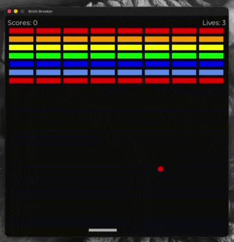

# Brick Breaker
The classic brick breaker game built with Python.

---

The aim of the game is to move a paddle, left or right to bounce a ball so that it destroys all the bricks on the screen. 
This project was created as part of my programming practice to improve my understanding of game loops, collision detection as well as GUI implementation.

---

# Demo





---

# Features

* Paddle controlled by keyboard input (left and right arraow keys, return key)
* Ball physics and bouncing mechanics
* Brick collision detection
* Score and life tracking
* Game over and restart functionality
* Simple GUI interface

---

# Systems Used

* **Python**
* **PyQt** 
* Object-Oriented Programming
* Game loop architecture

---

# Project Structure

```
brick-breaker/
│
├── main.py          # Entry point of the game
├── paddle.py        # Paddle logic
├── ball.py          # Ball movement and physics
├── brick.py         # Brick generation and collision
├── settings.py      # Visual Settings of the game 
├── assets/          # Images 
├── README.md
├── requirements.txt
```

---

# Installation

1. Clone the repository

```bash
git clone https://github.com/Jadi404/brick_breaker.git
```

2. Navigate to the project folder

```bash
cd brick_breaker
```

3. Install dependencies

```bash
pip install -r requirements.txt
```

---

# How to Run

Run the game with:

```bash
python main.py
```

---

# Controls

| Key         | Action            |
| ----------- | ----------------- |
| Left Arrow  | Move paddle left  |
| Right Arrow | Move paddle right |
| Enter       | Restart game      |

---

# What I Learned

* Implementing a game loop in Python
* Handling collision detection
* Managing object interactions
* Structuring a small software project
* Improving problem-solving and debugging skills
* Improving my understanding of PyGame
  
---

#  Future Improvements

* Add sound effects
* Add multiple levels
* Power-ups (multi-ball, larger paddle)
* High score system
* Improved graphics

---

# License

This project is licensed under the MIT License.

---

